# UziiShop 🛍️

> A clean, modern Flutter e-commerce app built to showcase real-world mobile UI/UX and end-to-end shopping flow.

---

## 📋 Overview

**UziiShop** is a portfolio-level Flutter mobile application designed to simulate a complete customer-side e-commerce experience. From splash screen to order confirmation, the app walks through a realistic shopping journey — built with a focus on polished UI, smooth navigation, and reusable component design.

This project was developed to demonstrate Flutter development skills including screen architecture, state management, custom widgets, and modern mobile UX patterns.

---

## ✨ Features

- 🟢 **Splash Screen** — branded app entry animation
- 🔐 **Login / Authentication Flow** — clean and user-friendly auth screens
- 🏠 **Home Screen** — featured products, categories, and promotional layout
- 🗂️ **Product Listing** — browsable product grid with clean card design
- 🔍 **Product Detail Screen** — full product view with images, description, and add-to-cart
- ❤️ **Wishlist** — save favourite items for later
- 🛒 **Cart** — item management, quantity update, and order summary
- 📦 **Multi-Step Checkout Flow** — shipping info → payment method → order review
- ✅ **Order Placed Success Screen** — confirmation screen with order feedback
- 📋 **My Orders** — view order history
- 🧾 **Order Details** — detailed view of individual orders
- 🔔 **Notifications** — notification list screen
- 👤 **My Profile** — user profile screen
- 🔄 **Smooth Navigation** — consistent app flow across all screens
- 🎨 **Polished UI/UX** — thoughtful spacing, typography, and visual hierarchy throughout

---

## 🎨 UI / UX Highlights

- Consistent design language across all screens
- Intuitive multi-step checkout with clear progress indication
- Clean product cards with image, title, and pricing
- Responsive layouts built with Flutter's widget system
- Reusable custom widgets for scalability
- Mobile-first design decisions throughout

---

## 🛠️ Tech Stack

| Layer | Technology |
|---|---|
| Framework | Flutter |
| Language | Dart |
| State Management | Provider *(or equivalent)* |
| Local Storage | SharedPreferences *(if applicable)* |
| Fonts | Google Fonts *(if applicable)* |
| Image Handling | Cached Network Image *(if applicable)* |
| Data Layer | Mock / Local data *(portfolio scope)* |

> **Note:** Exact packages may vary. This section reflects the general technology direction of the project.

---

## 📁 Project Structure

```
lib/
├── models/         # Data models
├── providers/      # State management
├── screens/        # All app screens
├── widgets/        # Reusable UI components
├── services/       # API / data services
├── utils/          # Constants, helpers, theme
└── main.dart       # App entry point
```

> Exact folder names may vary depending on implementation.

---

## 📸 Screenshots

<table>
  <tr>
    <td align="center"><b>Splash Screen</b></td>
    <td align="center"><b>Login Screen</b></td>
    <td align="center"><b>Home Screen</b></td>
  </tr>
  <tr>
    <td>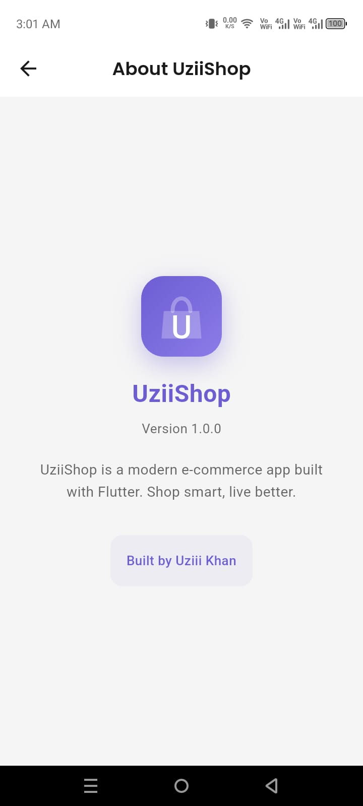</td>
    <td>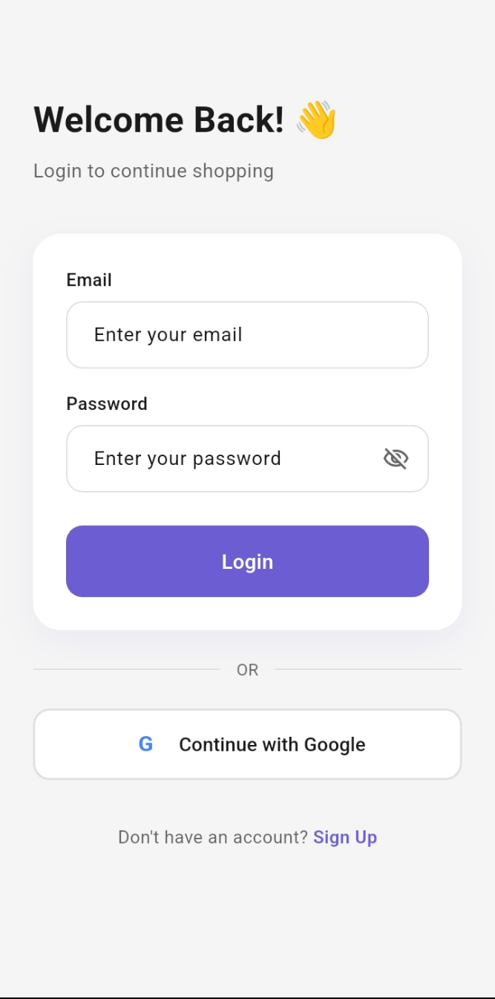</td>
    <td>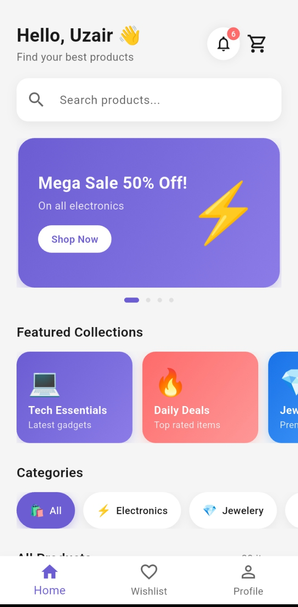</td>
  </tr>
  <tr>
    <td align="center"><b>Product Listing</b></td>
    <td align="center"><b>Product Detail</b></td>
    <td align="center"><b>Wishlist</b></td>
  </tr>
  <tr>
    <td>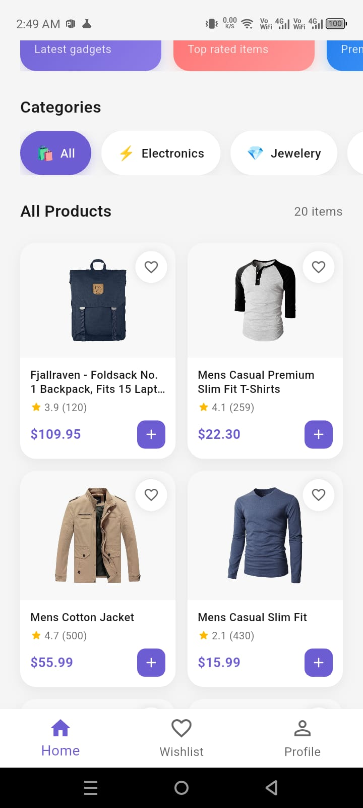</td>
    <td>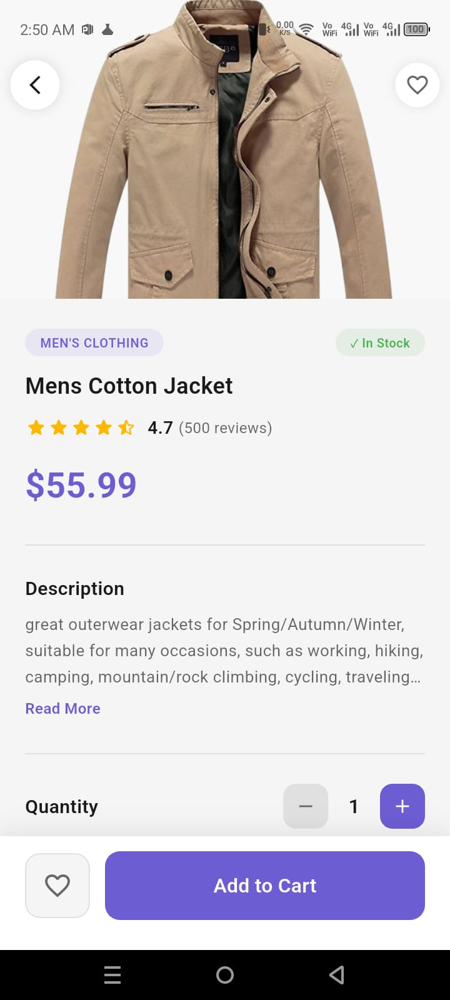</td>
    <td>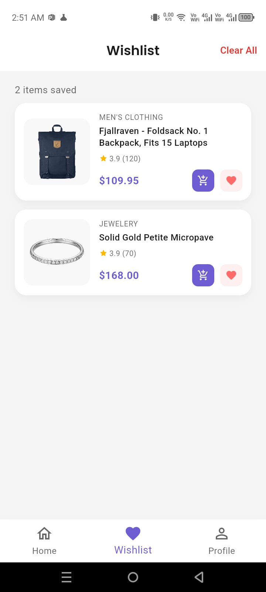</td>
  </tr>
  <tr>
    <td align="center"><b>Cart</b></td>
    <td align="center"><b>Checkout – Shipping Info</b></td>
    <td align="center"><b>Checkout – Payment Method</b></td>
  </tr>
  <tr>
    <td>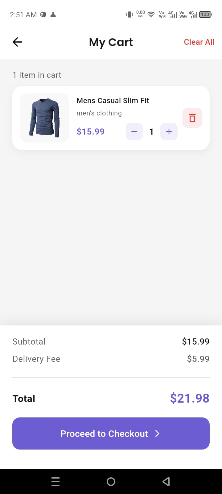</td>
    <td>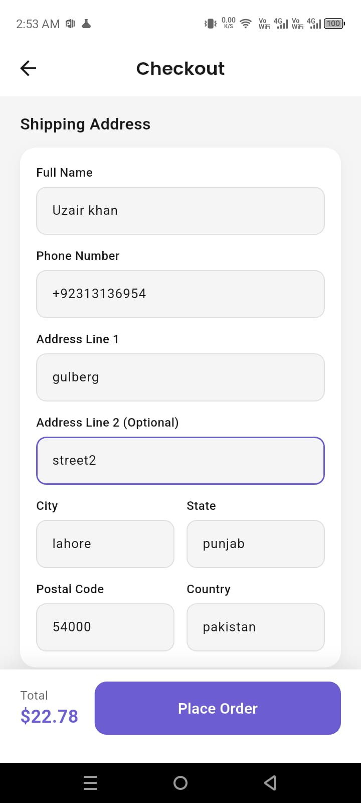</td>
    <td>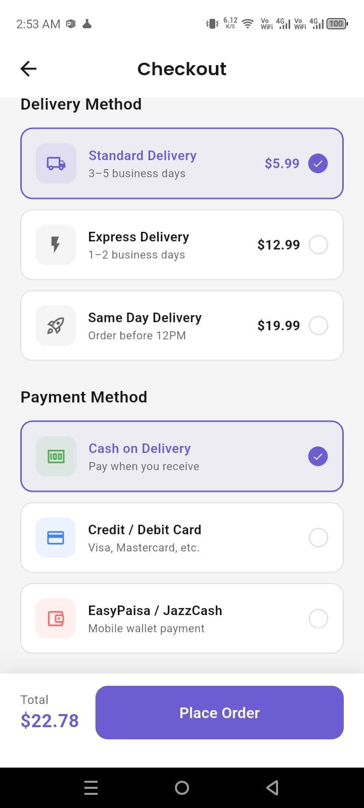</td>
  </tr>
  <tr>
    <td align="center"><b>Checkout – Order Review</b></td>
    <td align="center"><b>Order Placed</b></td>
    <td align="center"><b>My Orders</b></td>
  </tr>
  <tr>
    <td>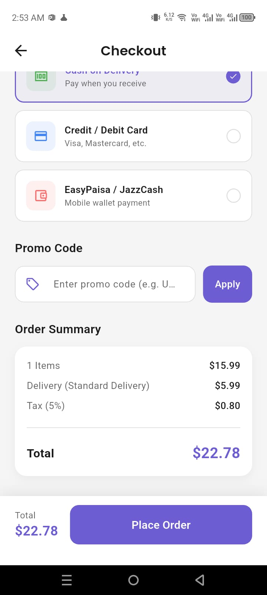</td>
    <td>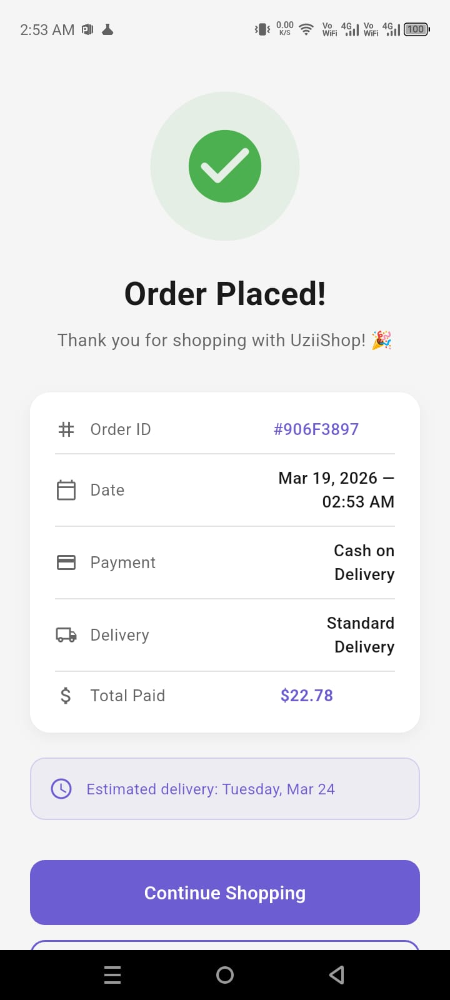</td>
    <td>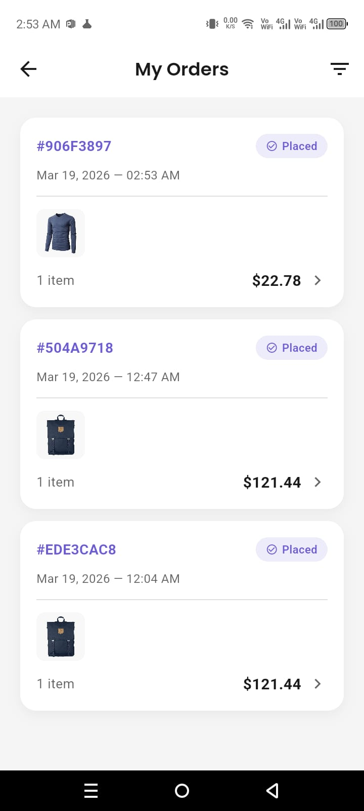</td>
  </tr>
  <tr>
    <td align="center"><b>Order Details</b></td>
    <td align="center"><b>Notifications</b></td>
    <td align="center"><b>My Profile</b></td>
  </tr>
  <tr>
    <td>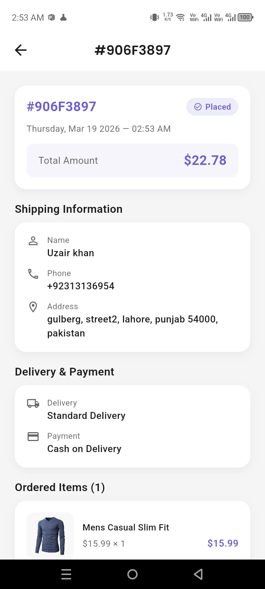</td>
    <td>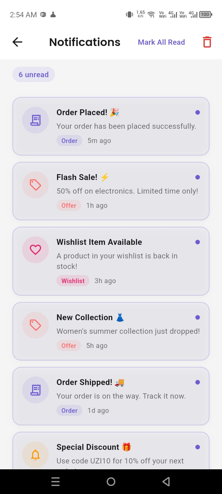</td>
    <td>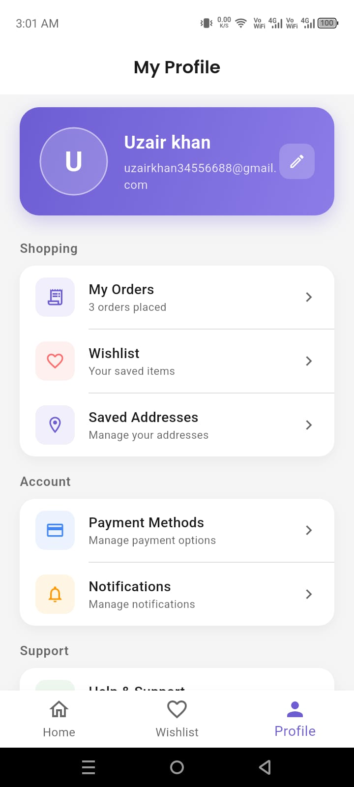</td>
  </tr>
</table>

---

## ⚙️ Installation & Setup

**Prerequisites:**
- Flutter SDK installed ([flutter.dev](https://flutter.dev))
- Dart SDK (included with Flutter)
- Android Studio / VS Code with Flutter plugin
- An Android emulator or physical device

**Clone the repository:**

```bash
git clone https://github.com/your-username/uzii-shop.git
cd uzii-shop
```

**Install dependencies:**

```bash
flutter pub get
```

---

## ▶️ How to Run

```bash
flutter run
```

To build a release APK:

```bash
flutter build apk --release
```

---

## 📌 Current Scope / Portfolio Note

UziiShop is built as a **portfolio and demonstration project**, focusing entirely on the **customer-side shopping experience**. The app showcases Flutter UI/UX skills, navigation architecture, and a realistic end-to-end e-commerce flow.

This version does **not** include a production backend, admin dashboard, or live payment gateway. These are intentional omissions for a portfolio-scoped project and are listed as planned future improvements.

---

## 🚀 Future Improvements

- [ ] Full Firebase backend integration (auth, Firestore, storage)
- [ ] Admin dashboard / seller management panel
- [ ] Real payment gateway integration (Stripe, PayFast, etc.)
- [ ] Push notifications via Firebase Cloud Messaging
- [ ] Coupon and discount system
- [ ] Product reviews & ratings (with backend)
- [ ] Dark mode support
- [ ] Multi-language / localization support
- [ ] Performance optimizations and lazy loading
- [ ] Unit and widget testing

---

## 👤 Author

**Uzair**
Flutter Developer

- 🐙 GitHub: [Add your GitHub link here]

---

## 📄 License

This project is licensed under the **MIT License** — free to use for educational and portfolio purposes.

```
MIT License — see LICENSE file for details.
```

---

<p align="center">Built by Uziii Khan</p>
